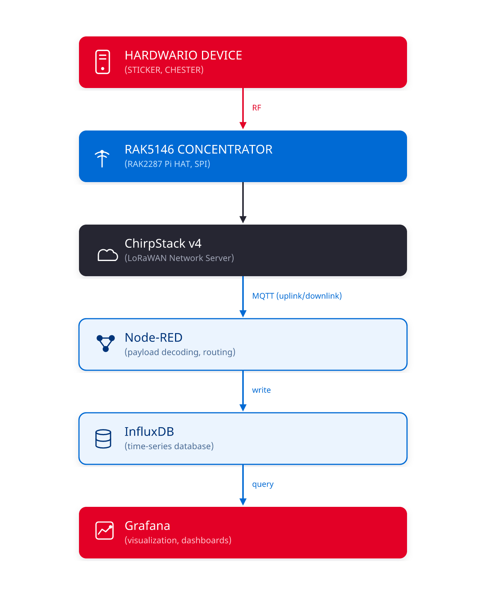

# FIBER Lite

Raspberry Pi 5 based all-in-one appliance for quickly bringing up and testing LoRaWAN devices
(e.g. HARDWARIO STICKER, CHESTER) — ChirpStack, InfluxDB, Node-RED, and Grafana on a single
board, plus a branded dashboard landing page.

Unlike the Compute Module 4 based [FIBER](https://docs.hardwario.com/fiber/installation), FIBER
Lite uses a plain Raspberry Pi 5 with the RAK2287 + RAK5146 concentrator on the **SPI** bus
(not USB) — a different hardware path.



**Full documentation:** [**docs/first-steps.md**](docs/first-steps.md) — quick start guide, the
fast path from unboxed to running. [**docs/introduction.md**](docs/introduction.md) —
architecture, bill of materials, key features. [**docs/installation.md**](docs/installation.md)
— the complete step-by-step walkthrough (screenshots, every install step, gateway/device
registration, ports and default credentials). [**docs/troubleshooting/**](docs/troubleshooting/)
— issues found so far and their fixes.

## Quick start

Flash the SD card, enable SSH, and find its IP first — see
[docs/installation.md](docs/installation.md#flash-raspberry-pi-os) for that part (screenshots
included). Then, on the device:

```sh
git clone https://github.com/hardwario/fiber-lite.git
cd fiber-lite
```

Run the scripts **in order**, one at a time — several require a reboot before continuing, and
`080`/`090` prompt interactively for passwords:

```sh
./scripts/010-update-system.sh      # then: sudo reboot
./scripts/020-configure-hardware.sh # then: sudo reboot
./scripts/030-install-docker.sh     # then: log out/in, or `newgrp docker`
./scripts/040-install-chirpstack.sh
./scripts/050-check-concentratord-prereqs.sh   # NOT YET VERIFIED — see warning it prints
./scripts/060-install-mqtt-forwarder.sh
./scripts/070-install-influxdb.sh   # save the printed token
./scripts/080-install-nodered.sh    # prints remaining manual steps (adminAuth setup)
./scripts/090-install-grafana.sh    # needs the InfluxDB token from 070
./scripts/100-install-dashboard.sh
./scripts/110-firewall.sh
```

Then register a gateway and a device in ChirpStack — see
[docs/installation.md](docs/installation.md#register-a-gateway-and-a-device) for the UI
walkthrough (not scriptable, ChirpStack has no CLI for this).

## Prerequisites

- Raspberry Pi 5
- microSD card (Raspberry Pi OS Lite 64-bit)
- RAK2287 + RAK5146 concentrator HAT (SPI) — **the scripts here stop at a prerequisite check for
  this; installing RAKwireless's SX1302 HAL is still manual, and the whole chain is not yet
  verified on real hardware**

## Layout

- `docs/` — the full documentation: introduction, installation walkthrough, troubleshooting.
- `scripts/` — the install steps above, one file per step, numbered in run order.
- `dashboard/` — the branded landing page (`index.html`), its stats backend (`serve.py`), and the
  systemd unit template. Copied into place by `100-install-dashboard.sh`.
- `config-templates/` — `chirpstack.toml` and `chirpstack-mqtt-forwarder.toml`, installed by the
  matching scripts (secrets are generated/substituted at install time, not stored here).

## Status

Everything except the concentrator/gateway registration chain has been verified on real
hardware (a physical FIBER Lite unit). The RAK2287 + RAK5146 SPI concentrator has not — no such
HAT has been connected during development yet. `050-check-concentratord-prereqs.sh` and the
"Register a Gateway and a Device" docs section are written from research, not verified operation.

## License

MIT — see [LICENSE](LICENSE).
