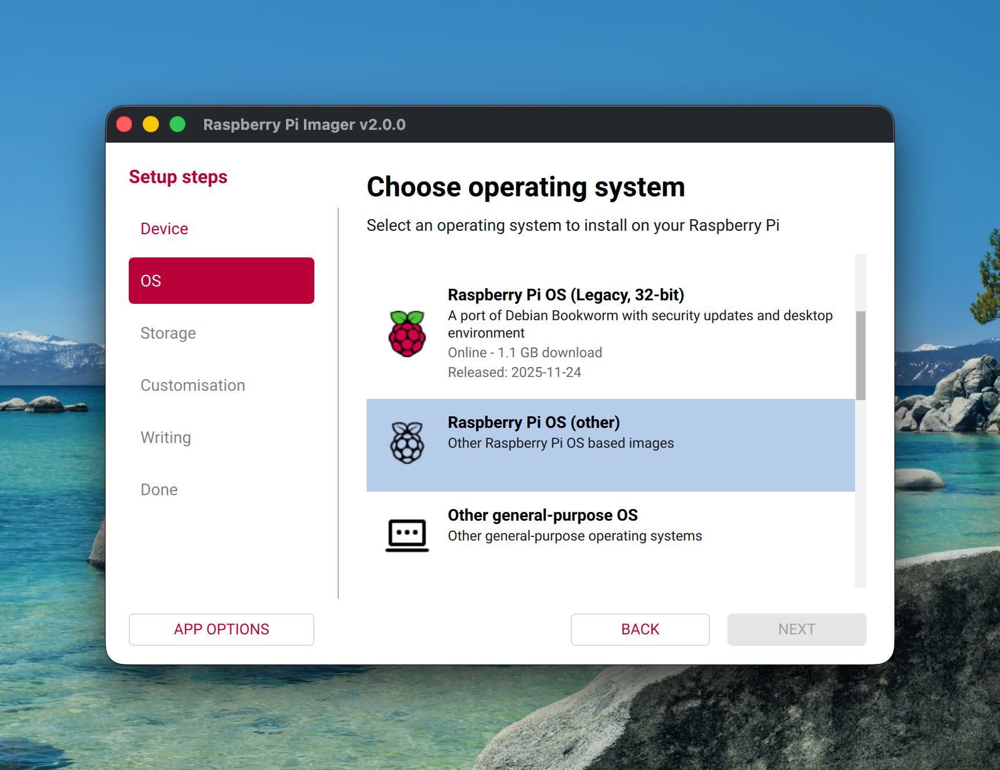
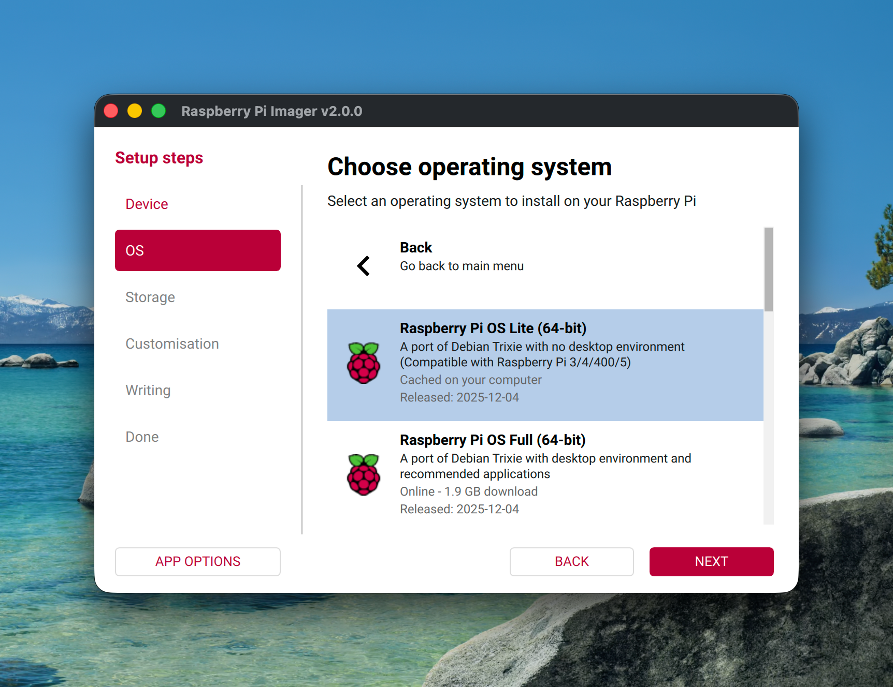
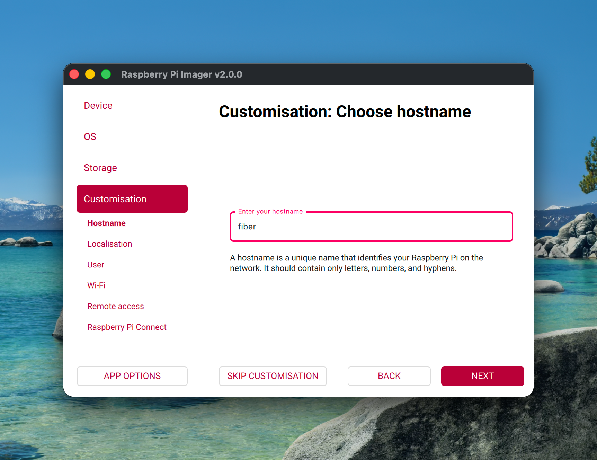
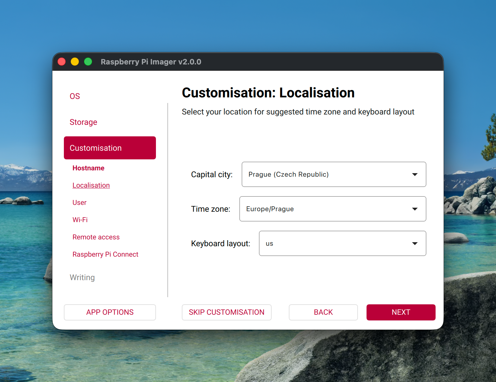
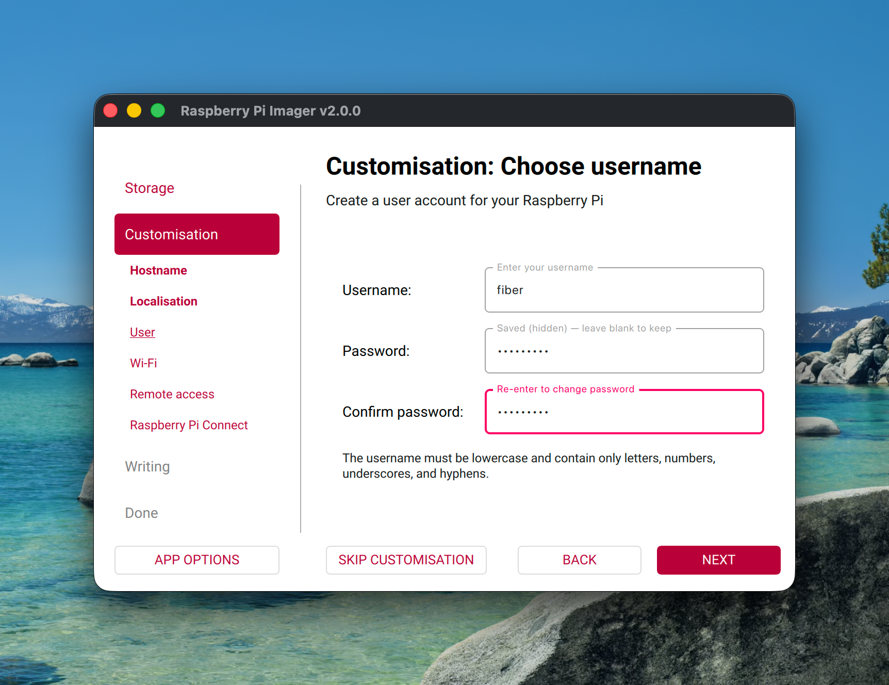
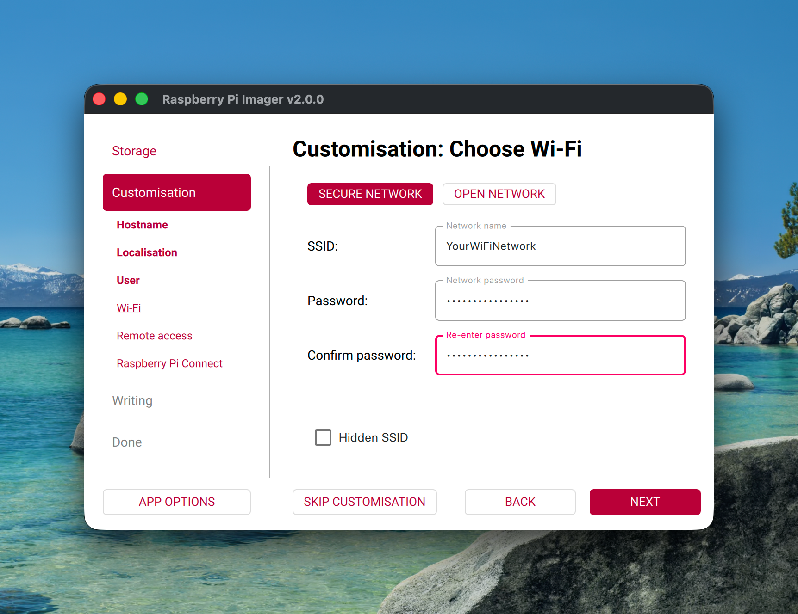
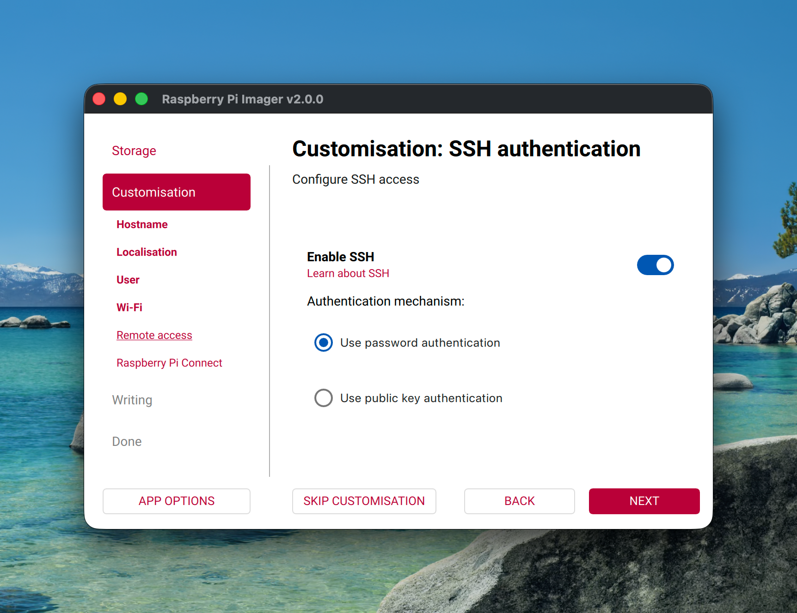
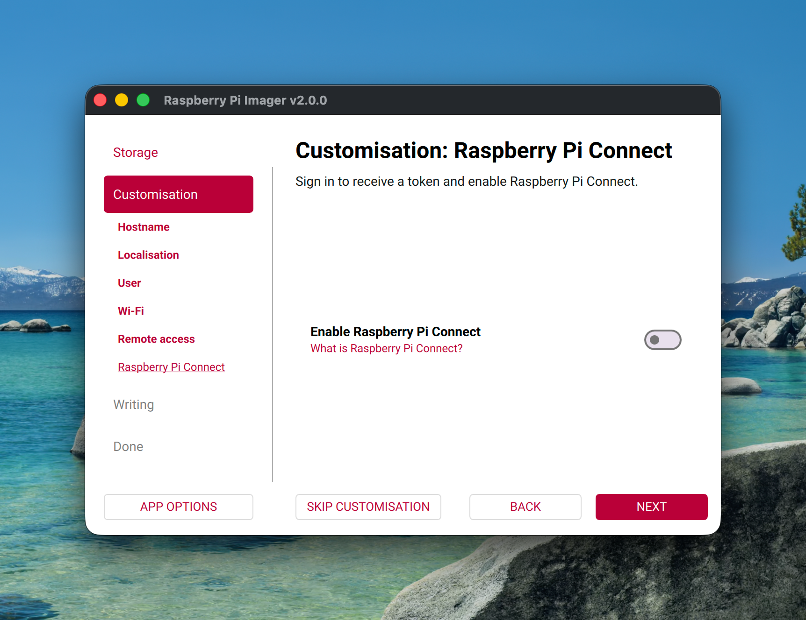
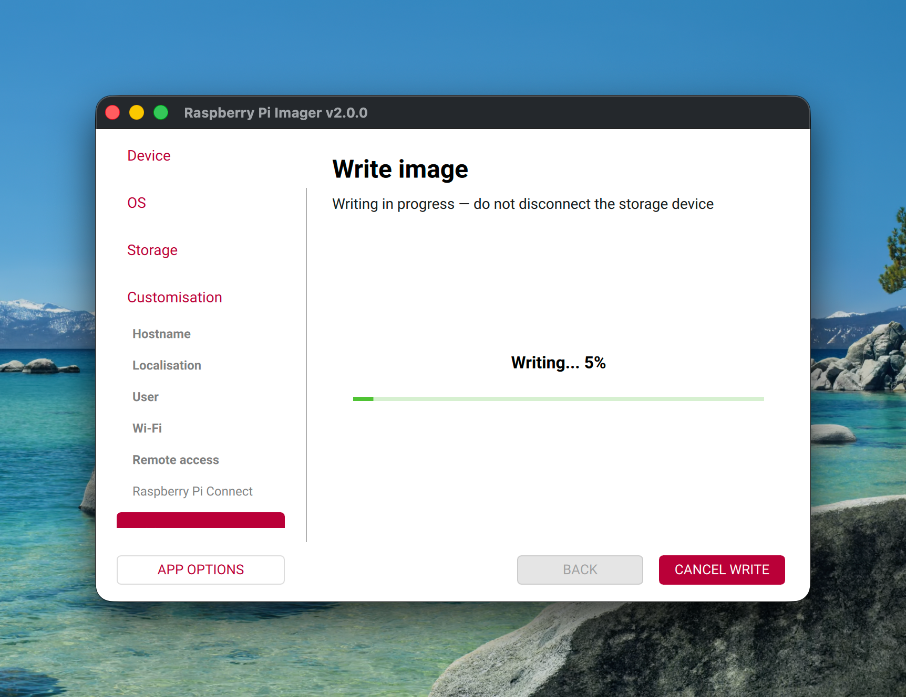

# Installation

This article provides instructions on bootstrap and configuration of the Linux system and full
LoRaWAN software stack on the **FIBER Lite** device, based on the **Raspberry Pi 5** platform.

Unlike the Compute Module 4 based [FIBER](https://docs.hardwario.com/fiber/installation), FIBER
Lite uses a plain Raspberry Pi 5 — there is no bootloader-activation step, no BOOT jumper, and no
`rpiboot` tool. You flash a microSD card directly, as with any standard Raspberry Pi.

## Flash Raspberry Pi OS

> [!TIP]
> The screenshots below are reused from the Raspberry Pi Imager flow on the CM4-based
> [FIBER](https://docs.hardwario.com/fiber/installation) guide, since the tool and most steps
> are identical regardless of device. A few steps look slightly different in practice: the
> **Device** picker shows **Raspberry Pi 5** highlighted instead of Raspberry Pi 4, the
> **Storage** step lists your microSD card reader by its own name instead of `RPi-MSD-0001
> Media` (that name is specific to the CM4's `rpiboot` USB boot mode, not used here), and the
> example hostname/username shown is `fiber`/`fiber` rather than `fiber-lite`/`fiberlite` — use
> the FIBER Lite values given in the steps below regardless of what the screenshot shows.

1. Download, install, and launch the [**Raspberry Pi Imager**](https://github.com/raspberrypi/rpi-imager) tool.

1. In the **Device** step, select **Raspberry Pi 5**.

1. In the **OS** step, select **Raspberry Pi OS (other)**.

   

1. Select **Raspberry Pi OS Lite (64-bit)**.

   

1. In the **Storage** step, select the microSD card for the FIBER Lite device.

1. In the **Customisation** step (gear icon, or Ctrl+Shift+X), enter a hostname for your FIBER
   Lite device (e.g. `fiber-lite`).

   

1. In the **Localisation** section, select your location, time zone, and keyboard layout.

   

1. In the **User** section, enter a username and password.

   

   > [!TIP]
   > You can use `fiberlite` for username and `hardwario` for password.

   > [!WARNING]
   > This is only recommended with public-key SSH authentication, otherwise use a strong
   > passphrase.

1. Optional: in the **Wi-Fi** section, enter your wireless network's SSID and password as a LAN
   fallback.

   

1. In the **Remote access** section, enable **SSH** and select your preferred authentication
   method.

   

1. Optional: in the **Raspberry Pi Connect** section, you can enable remote access via Raspberry
   Pi Connect. For this guide, we leave it disabled.

   

1. Review the summary and click **WRITE** to start flashing, then confirm the warning dialog.

1. Wait for the writing process to complete.

   

1. When writing completes, insert the microSD card into the FIBER Lite device and power it on.

1. Wait for the device to boot and connect to the network (30-90 seconds on first boot), then
   find its IP address. Try these in order:

   - **Router/DHCP leases** — check your router's admin page for a client named after the
     hostname you set (e.g. `fiber-lite`).
   - **mDNS** — `ping raspberrypi.local` or `ping <hostname>.local` (the hostname you set in
     Imager), if mDNS resolves on your network.
   - **Network scan** — from another machine on the same LAN/subnet:

     ```sh
     nmap -sn 192.168.1.0/24
     ```

     replacing `192.168.1.0/24` with your actual subnet. Look for a new host that wasn't there
     before you powered on the device.
   - **Monitor + keyboard** — as a last resort, connect a display and keyboard directly to the
     Pi and run `hostname -I` at the console.

   > [!TIP]
   > **Skip the guesswork with a static IP.** Instead of hunting for whatever address DHCP
   > handed out, set one yourself before first boot: put the freshly flashed card back into
   > your computer and create `network-config` at the root of the boot partition (`bootfs`, the
   > small FAT volume — same partition as `meta-data`/`user-data`):
   >
   > ```yaml
   > version: 2
   > ethernets:
   >   eth0:
   >     dhcp4: false
   >     addresses:
   >       - 192.168.1.50/24
   >     gateway4: 192.168.1.1
   >     nameservers:
   >       addresses: [192.168.1.1, 1.1.1.1]
   > ```
   >
   > Adjust the address, gateway, and subnet to match your network, then boot the device and
   > SSH straight to `192.168.1.50` — no lease lookup or scan needed.
   >
   > This only applies on an instance's **first** boot, the same as `user-data` — see the
   > cloud-init gotcha below. If you're adding this file to a card that has already booted once
   > (so the account already exists), also bump `instance-id` in `meta-data` to a new value,
   > otherwise cloud-init skips it as "already configured."

1. SSH into the device using the username and IP address (or hostname) from the previous steps:

   ```sh
   ssh fiberlite@<TARGET IP ADDRESS>
   ```

   Accept the host key fingerprint prompt on first connection, then enter the password you set
   in Imager. All commands in the rest of this guide are run from this SSH session, on the
   device itself.

> [!WARNING]
> **Cloud-init gotcha.** Recent Raspberry Pi OS images use **cloud-init** instead of the older
> `ssh`-file/`userconf.txt` mechanism. If you ever need to hand-edit `/boot/firmware/meta-data`
> directly (instead of using Imager's Customisation dialog), the key **must** be `instance-id`
> (hyphen), **not** `instance_id` (underscore) — the underscored key is silently ignored, and
> cloud-init will skip user creation on every subsequent boot, causing "Permission denied" on
> SSH indefinitely even after fixing `user-data`. Always use Imager's own dialog for the
> username/password/SSH settings; you should not need to touch cloud-init files by hand in
> normal use. If SSH connections are refused outright (no password prompt at all), or accepted
> but every password is rejected, see [**Troubleshooting**](troubleshooting/).

## Clone this repo

```sh
git clone https://github.com/hardwario/fiber-lite.git
cd fiber-lite
```

Everything below is one of the numbered scripts in `scripts/`, run **in order** — each one is
short and readable; open it if you want to see exactly what it does before running it.

## Update System

```sh
./scripts/010-update-system.sh
```

Then `sudo reboot`.

## Configure Hardware

```sh
./scripts/020-configure-hardware.sh
```

Then `sudo reboot`.

> [!WARNING]
> **Do not add an external RTC overlay.** The Compute Module 4 based FIBER guide adds
> `dtoverlay=i2c-rtc,pcf85063a,i2c_csi_dsi` for an external PCF85063A real-time clock chip.
> **Do not add this on FIBER Lite.** The Raspberry Pi 5 has a **native built-in RTC** that
> registers automatically as `rtc0` — the external overlay has no chip to talk to and only
> produces a harmless-but-noisy `error -EREMOTEIO` in the kernel log. The script above already
> knows this and doesn't add it.

## Install Docker

Docker is required for the dashboard landing page (see [Dashboard](#dashboard) below).

```sh
./scripts/030-install-docker.sh
```

Then log out and back in (or run `newgrp docker`) — group membership only takes effect on next
login.

> [!TIP]
> Debian's package is named `docker-compose` (not `docker-compose-plugin`, which is Docker's
> own repository naming and is not available from the default Raspberry Pi OS repositories).
> Both the `docker compose` and `docker-compose` command forms work after installing it.

## Install ChirpStack

```sh
./scripts/040-install-chirpstack.sh
```

Now you can access **ChirpStack** at `http://[TARGET IP ADDRESS]:8080/`.

> [!WARNING]
> The default login is `admin` / `admin`. Change this password before exposing the device on
> any shared network.

## Install ChirpStack Concentratord (RAK2287 + RAK5146, SPI)

> [!WARNING]
> **Not yet verified on real hardware.** The steps in this section were researched but never
> actually tested against a connected RAK2287 + RAK5146 — treat them as a documented starting
> point, not a guaranteed working procedure. Update this section once verified.

The FIBER Lite concentrator is the **RAK5146** LoRaWAN concentrator card seated on a **RAK2287**
Pi HAT, connected via **SPI** — this is a different hardware path (SPI device + GPIO reset pin)
than the USB-connected RAK5146 variant used on the Compute Module 4 based FIBER.

```sh
./scripts/050-check-concentratord-prereqs.sh
```

This only checks that SPI is enabled and the HAT is detected — it does not install the SX1302
HAL. Use **RAKwireless's own SX1302 HAL installer** for the RAK2287 on Raspberry Pi, rather than
the generic ChirpStack Concentratord USB configuration used on the CM4-based FIBER — the SPI
variant needs the correct SPI device path and GPIO reset-pin handling that RAKwireless's own
tooling provides. See RAKwireless's documentation for the RAK2287/RAK5146 Raspberry Pi HAT for
the current installer script and region configuration (EU868 for European deployments).

Once running, check the Concentratord logs to obtain the **Gateway ID**, which you'll need to
register the gateway in ChirpStack:

```sh
sudo journalctl -fu chirpstack-concentratord
```

## Install ChirpStack MQTT Forwarder

This installs the **ChirpStack MQTT Forwarder** that connects the Concentratord to the MQTT
broker. It depends on Concentratord already running (see above).

```sh
./scripts/060-install-mqtt-forwarder.sh
```

Check logs with `sudo journalctl -fu chirpstack-mqtt-forwarder`.

## Register a Gateway and a Device

> [!WARNING]
> This section builds directly on the concentrator setup above, which is **not yet verified on
> real hardware**. The ChirpStack UI steps themselves are standard ChirpStack v4 usage and apply
> regardless of concentrator model, but the whole chain has not been exercised end-to-end
> (gateway → real uplink) on a FIBER Lite unit yet.

Installing the software gets ChirpStack, the concentrator, and the MQTT forwarder running, but
nothing joins the network until a **gateway** and at least one **device** are registered inside
ChirpStack itself. This part isn't scriptable — ChirpStack has no CLI for it.

1. Log in to ChirpStack (`http://[TARGET IP ADDRESS]:8080/`, `admin`/`admin` or whatever you
   changed it to). A default tenant named **ChirpStack** already exists — use it, or create your
   own under **Tenants**.

1. Under **Gateways**, click **Add gateway**:
   - **Gateway ID** — copy this from the Concentratord logs (`sudo journalctl -fu
     chirpstack-concentratord`), printed once the concentrator connects.
   - **Name** — anything descriptive, e.g. `fiber-lite-gw`.
   - **Region** — must match one of the `enabled_regions` in `/etc/chirpstack/chirpstack.toml`
     (e.g. `eu868` for Europe).

   Once saved, the gateway's detail page shows a **Last seen at** timestamp that updates
   periodically if the concentrator → MQTT forwarder → ChirpStack chain is actually working.

1. Under **Device profiles**, click **Add device profile**. At minimum set:
   - **Region** — same region as the gateway.
   - **MAC version** — match what your test device (e.g. STICKER, CHESTER) actually speaks
     (LoRaWAN 1.0.x for most HARDWARIO devices; check the device's own documentation).
   - **Regional parameters revision** — leave at ChirpStack's default unless your device needs a
     specific one.
   - **Join type** — **OTAA** for typical HARDWARIO devices.

1. Under **Applications**, click **Add application** to group devices under (e.g.
   `fiber-lite-test`).

1. Inside that application, click **Add device**:
   - **Device EUI** — the DevEUI printed on the physical device or its documentation.
   - **Device profile** — the one created above.
   - **Device name** — anything descriptive.

   After creating the device, open its **OTAA keys** tab and set the **Application key**
   (`AppKey`) — and **Network key** (`NwkKey`) if the device profile is LoRaWAN 1.1 — to match
   what is programmed into the physical device. These must match exactly on both sides or the
   join will silently fail.

1. Power on the physical LoRaWAN device. Watch the device's **LoRaWAN frames** tab (live view) in
   the ChirpStack UI — a join-request followed by a join-accept should appear within seconds if
   the gateway is in range and everything above is configured correctly. If nothing appears at
   all, re-check the gateway's **Last seen at** timestamp first — no traffic reaching the gateway
   means the problem is on the radio/concentrator side, not the device registration.

   > [!TIP]
   > Once joined, uplinks publish to the MQTT topic
   > `application/<application-id>/device/<dev-eui>/event/up` — the same wildcard topic
   > (`application/+/device/+/event/up`) the Node-RED flow below subscribes to.

## Install InfluxDB

```sh
./scripts/070-install-influxdb.sh
```

It prompts for a password, then prints the generated API token — save both. You'll need the
token again for the Node-RED flow and the Grafana datasource below.

## Install Node-RED

```sh
./scripts/080-install-nodered.sh
```

This installs Node-RED and sets the credential-encryption secret automatically, then prints the
remaining steps — they're genuinely interactive (choosing a password, hashing it), not something
a script can safely do for you:

1. `sudo reboot`
1. `node-red admin hash-pw` — enter an admin password when prompted, copy the bcrypt hash it
   prints
1. Edit `~/.node-red/settings.js` — uncomment the `adminAuth` block and fill in that hash. **Do
   this before exposing Node-RED on any network** — it's wide open by default, and Node-RED's own
   install output explicitly warns against leaving it unsecured.
1. `cd ~/.node-red && npm install node-red-contrib-influxdb`
1. `sudo systemctl restart nodered.service`

Then build a flow: **MQTT in** (topic `application/+/device/+/event/up`, broker
`localhost:1883`) → **Function** (parse the ChirpStack uplink JSON, set `msg.measurement` and
`msg.payload = [fields, tags]`) → **InfluxDB out** (config node: `influxdbVersion: "2.0"`, `url:
http://localhost:8086`, token from the InfluxDB step; node: `org: fiber-lite`, `bucket:
fiber-lite`).

> [!TIP]
> Without a LoRaWAN gateway/device connected yet, this flow is scaffolding — build it now so
> it's ready as soon as a gateway and device are registered (see
> [Register a Gateway and a Device](#register-a-gateway-and-a-device) above) and passing real
> uplinks.

Now you can access **Node-RED** at `http://[TARGET IP ADDRESS]:1880/`.

## Install Grafana

```sh
./scripts/090-install-grafana.sh
```

It prompts for a new admin password, then for the InfluxDB token from the step above, and wires
up the datasource automatically.

Now you can access **Grafana** at `http://[TARGET IP ADDRESS]:3000/`.

> [!TIP]
> Dashboard panels are best built once there's real device/gateway data flowing in — there's
> nothing meaningful to visualize before that.

## Dashboard

FIBER Lite ships a landing page on port 80 with tiles linking to every service, live system
metrics, and an SSH quick-copy button — styled to the HARDWARIO brand (colors, typography, logo).
It's the real `dashboard/index.html` + `dashboard/serve.py` in this repo (see the
[README](../README.md#layout) for a preview of both) — no external framework or Docker container
required for the page itself.

```sh
./scripts/100-install-dashboard.sh
```

Now you can access the dashboard at `http://[TARGET IP ADDRESS]/`. It includes a light/dark
theme toggle (persisted per browser), a service search filter, and tiles for every service plus
SSH/GitHub links.

## Firewall

```sh
./scripts/110-firewall.sh
```

It asks for your LAN subnet (e.g. `10.0.0.0/24`) and opens exactly the ports needed (`80`,
`1880`, `8080`, `8086`, `3000`) to that subnet, plus SSH (`22`) to everyone — **in that order**,
so you don't lock yourself out.

Immediately verify SSH and all web UIs are still reachable from another machine on the LAN
before disconnecting.

## Ports & Default Credentials

| Service | Port | URL | Default Login |
|---|---|---|---|
| Dashboard | 80 | `http://[TARGET IP ADDRESS]/` | — (no authentication) |
| ChirpStack | 8080 | `http://[TARGET IP ADDRESS]:8080/` | `admin` / `admin` |
| Node-RED | 1880 | `http://[TARGET IP ADDRESS]:1880/` | set during installation (`adminAuth`) |
| InfluxDB | 8086 | `http://[TARGET IP ADDRESS]:8086/` | set during installation (`influx setup`) |
| Grafana | 3000 | `http://[TARGET IP ADDRESS]:3000/` | set during installation (changed from `admin`/`admin`) |
| SSH | 22 | `ssh <user>@[TARGET IP ADDRESS]` | set in Raspberry Pi Imager |
| Mosquitto (MQTT) | 1883 | internal only (`localhost`) | — |

> [!WARNING]
> **ChirpStack's default login (`admin` / `admin`) is not changed by any script above** — unlike
> Node-RED and Grafana, which get a password set during installation, ChirpStack ships with the
> stock default and nothing in this guide rotates it. Change it before exposing the device on any
> shared network: log in to the web UI and update the password under the user's account settings.

Running into problems? See [**Troubleshooting**](troubleshooting/) for common issues and their
fixes.
